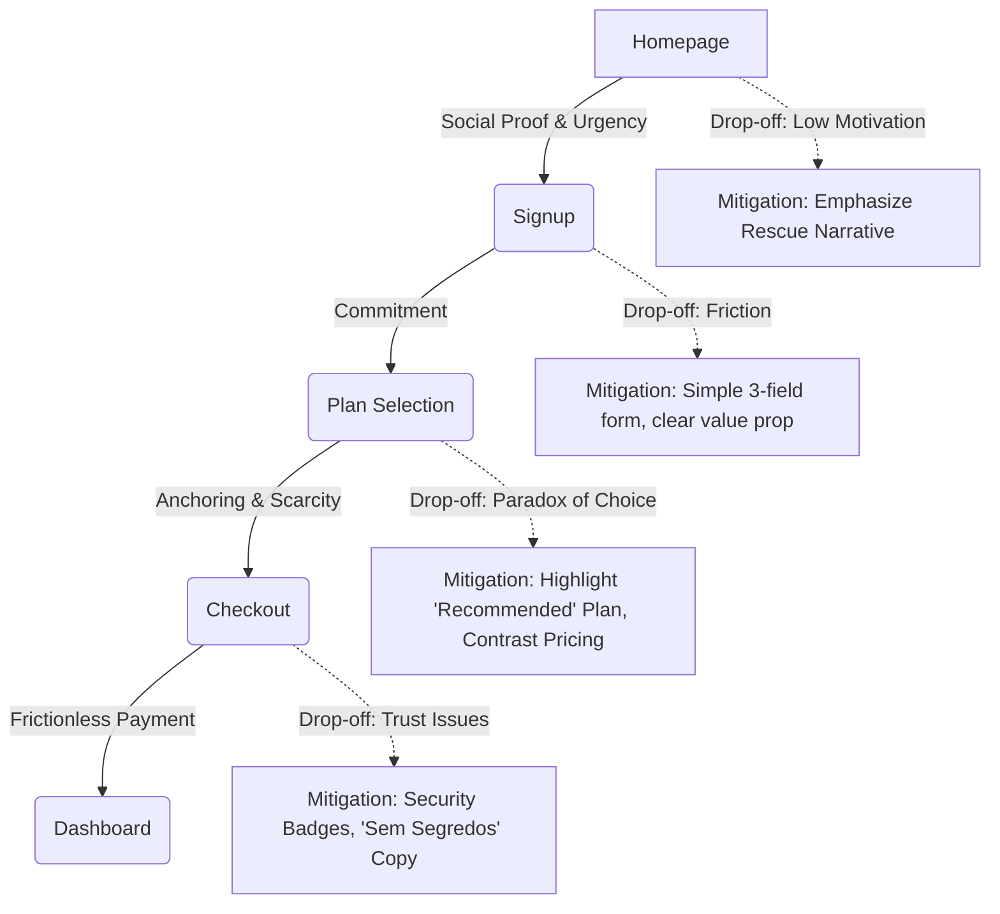

# UX Strategy & Behavioral Playbook

This document outlines the behavioral design strategy for the Clube Atlético Tubarão SAF platform. It explains *why* UX decisions follow specific persuasion psychology principles to prevent regression to generic, emotionally inert implementations.

## Target Emotions per Page

| Route/Page | Primary Emotion | Secondary Emotion | Strategy |
| :--- | :--- | :--- | :--- |
| Homepage (`/`) | Belonging | Urgency | Connect user to the "Operation Rescue" narrative; create a sense that immediate action is needed. |
| Dashboard (`/member`) | Pride | Achievement | Show progress, gamification elements, and validate their contribution to the club. |
| Transparency Portal (`/transparencia`) | Trust | Relief | Clear, unquestionable data. Radical transparency builds confidence. |
| Store (`/loja`) | Desire | Exclusivity | Highlight member-only items, limited drops, and tangible benefits of being a socio. |
| Checkout/Signup (`/signup`) | Commitment | Anticipation | Frictionless process, reaffirming the decision to join the cause. |

## Conversion Funnel Map

## Behavioral Levers in Use (Cialdini Principles)

1. **Social Proof (Prova Social)**
   - **Application:** Live member counter on the Homepage.
   - **Why:** Seeing others join validates the decision and creates a "bandwagon" effect.

2. **Scarcity (Escassez)**
   - **Application:** "Limited Edition" tags in the Store; countdowns for early-adopter plan benefits.
   - **Why:** Drives immediate action to avoid missing out (FOMO).

3. **Reciprocity (Reciprocidade)**
   - **Application:** Transparency portal providing immense, free, accessible financial data to the public before asking for membership.
   - **Why:** Giving value first makes users more likely to reciprocate by supporting the club.

4. **Commitment & Consistency (Compromisso e Coerência)**
   - **Application:** Small initial pledges or email signups before full checkout; gamification streaks in the Dashboard.
   - **Why:** Users who take a small step are more likely to follow through with a larger commitment (membership).

5. **Authority (Autoridade)**
   - **Application:** Prominent display of audit partners or legal compliance badges in the Transparency Portal.
   - **Why:** Establishes credibility, critical for creditors and hesitant fans.

6. **Liking (Afeição)**
   - **Application:** Fan testimonial carousel on the Homepage; relatable imagery of fans in the signup flow.
   - **Why:** Users support entities they relate to and feel a connection with.

7. **Unity (Unidade)**
   - **Application:** "Family" status badge in the Dashboard header; "A reconstrução é nossa" hero copy on the Homepage.
   - **Why:** Leverages shared identity and civic duty towards the club.

## Copy Guidelines

**Tone of Voice:** `"formal na transparência, apaixonado na torcida"` (Formal in transparency, passionate in the stands).

**Required Narrative Anchors:**
1. `"sem segredos"` (No secrets)
2. `"a reconstrução é nossa"` (The reconstruction is ours)
3. `"operação resgate"` (Operation Rescue)
4. `"cada centavo conta"` (Every cent counts)
5. `"orgulho de ser Tubarão"` (Proud to be Tubarão)

**Forbidden Phrases:**
1. `"em breve"` (Coming soon) - Replace with concrete timelines or remove.
2. `"se Deus quiser"` (God willing) - Passive; we need active ownership.
3. `"tentaremos"` (We will try) - Use assertive language ("faremos", "estamos trabalhando para").
4. `"talvez"` (Maybe) - Project confidence.
5. `"ajude o clube"` (Help the club) - Frame as an investment or partnership, not charity.

## A/B Testing Plan

| Element | Hypothesis | Metric | Minimum Detectable Effect (MDE) |
| :--- | :--- | :--- | :--- |
| **Hero CTA Copy** | "Junte-se à Reconstrução" converts better than "Seja Sócio". | Signup Click-through Rate (CTR) | +15% |
| **Pricing Anchor** | Highlighting the middle tier as "Most Popular" increases Average Order Value (AOV). | AOV at Checkout | +10% |
| **Live Counter Position** | Placing the live member counter above the fold increases trust and urgency. | Time on Site & Conversion Rate | +5% Conversion |
| **Transparency Teaser** | Adding a mini debt-reduction chart on the homepage increases credibility. | Bounce Rate | -10% |
| **Form Length** | Splitting signup into 2 steps (Email -> Details) reduces abandonment. | Form Completion Rate | +20% |

## Do Not Regress

This is a checklist of emotional design decisions that **must not be removed** without updating this document and justifying the regression:

- [ ] The live member counter must remain prominently displayed.
- [ ] The transparency portal must never hide negative data (maintains trust).
- [ ] Gamification elements (badges, streaks) in the dashboard must not be simplified into plain text.
- [ ] The "Operation Rescue" narrative must remain the central hook of the homepage.
- [ ] Store items must retain scarcity markers (e.g., "Only 5 left") when applicable.
