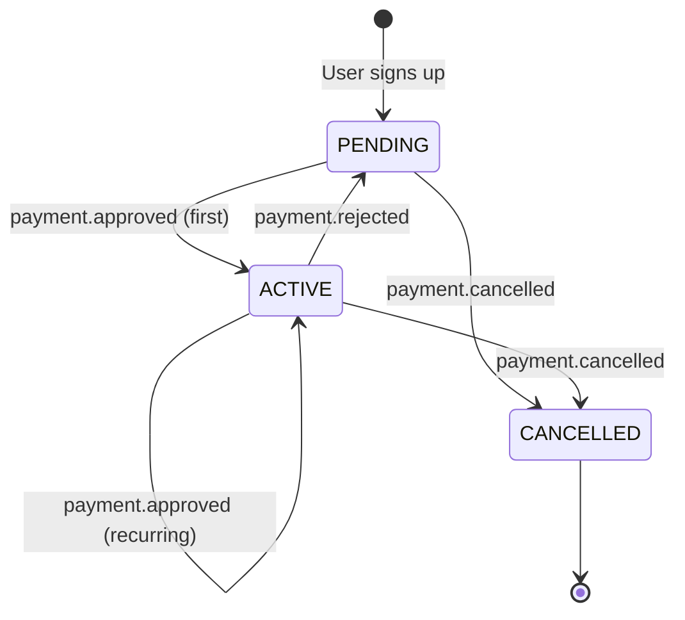

# Mercado Pago Webhooks

This document outlines the integration with Mercado Pago webhooks, detailing signature verification, event handling, payload structures, and their impact on the member lifecycle.

## Signature Verification Algorithm

We verify the authenticity of incoming webhooks to ensure they genuinely originated from Mercado Pago. This implementation matches our exact logic in `apps/api/src/modules/webhooks/signature.ts` (MEMBER-007).

### Step-by-Step Verification

1.  **Extract headers**: Retrieve the `x-signature` and `x-request-id` headers from the incoming request.
    *   The `x-signature` header contains a string formatted as `ts=...,v1=...`.
2.  **Parse `x-signature`**: Split the `x-signature` string by commas (`,`) and then by equals (`=`) to extract the timestamp (`ts`) and the hash (`v1`).
3.  **Extract `data.id`**: Parse the JSON payload of the request to extract the `data.id` value. This ID is used to construct the manifest.
4.  **Construct the Manifest**: Build the manifest string exactly as follows:
    ```
    id:${dataId};request-id:${requestId};ts:${ts};
    ```
5.  **Compute HMAC**: Generate an HMAC-SHA256 hash of the manifest string using the `MP_WEBHOOK_SECRET` environment variable as the key.
6.  **Compare**: Compare the resulting hex digest with the extracted `v1` value. If they match, the request is authentic.

## Member Lifecycle Mapping

Webhook events trigger specific state transitions and side effects in the system, primarily impacting the member's subscription status.

| Event | Previous Status | New Status | Side Effects |
| :--- | :--- | :--- | :--- |
| `payment.approved` (first) | PENDING | ACTIVE | Generate card, send WelcomeEmail, record REFERRAL for referrer |
| `payment.approved` (recurring) | ACTIVE | ACTIVE | Renew card, send PaymentConfirmedEmail |
| `payment.rejected` | ACTIVE | PENDING | Begin delinquency counter |
| `payment.cancelled` | any | CANCELLED | Invalidate card, cancel MP preapproval |

## State Machine

The following diagram illustrates the lifecycle of a subscription based on incoming Mercado Pago webhook events.



## Example Payloads

Below are annotated JSON payloads for the key events processed by our system.

### `payment.approved`

This event fires when a payment is successfully captured. It transitions the user to `ACTIVE` (or keeps them `ACTIVE` if recurring).

```json
{
  "action": "payment.created",
  "api_version": "v1",
  "data": {
    "id": "1234567890" // The payment ID used in signature verification
  },
  "date_created": "2026-06-26T12:00:00Z",
  "id": 987654321,
  "live_mode": true,
  "type": "payment",
  "user_id": 44444
}
```
*(Note: For `payment` events, the system will look up the payment details using `data.id` via the Mercado Pago API to determine if it was approved and to which subscription it belongs).*

### `payment.rejected`

This event fires when a payment fails (e.g., insufficient funds, card declined). It transitions an `ACTIVE` subscription to `PENDING` and starts the delinquency process.

```json
{
  "action": "payment.updated",
  "api_version": "v1",
  "data": {
    "id": "1234567891"
  },
  "date_created": "2026-06-26T12:05:00Z",
  "id": 987654322,
  "live_mode": true,
  "type": "payment",
  "user_id": 44444
}
```

### `payment.cancelled`

This event fires when a payment or subscription is explicitly cancelled. It transitions the subscription to `CANCELLED`, invalidating the membership card.

```json
{
  "action": "payment.updated",
  "api_version": "v1",
  "data": {
    "id": "1234567892"
  },
  "date_created": "2026-06-26T12:10:00Z",
  "id": 987654323,
  "live_mode": true,
  "type": "payment",
  "user_id": 44444
}
```

### `subscription.updated`

This event fires when a preapproval (subscription) is modified, such as a plan upgrade or downgrade.

```json
{
  "action": "updated",
  "api_version": "v1",
  "data": {
    "id": "2c9380847b2c...a" // The preapproval ID
  },
  "date_created": "2026-06-26T12:15:00Z",
  "id": 987654324,
  "live_mode": true,
  "type": "subscription_preapproval",
  "user_id": 44444
}
```
